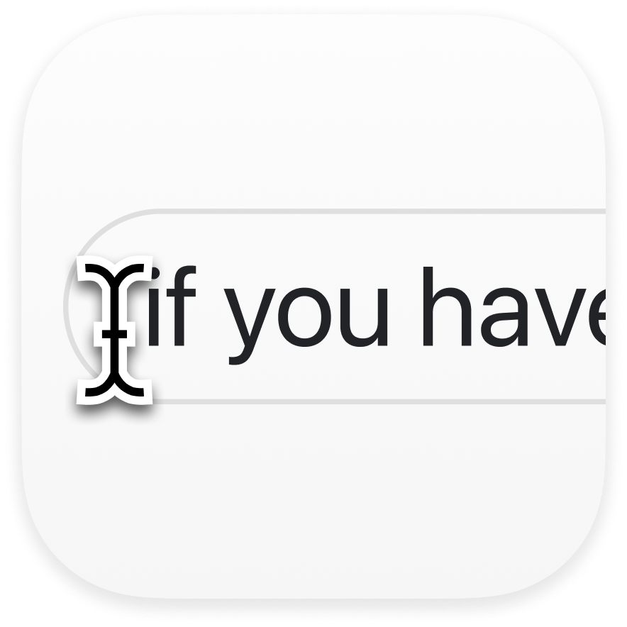
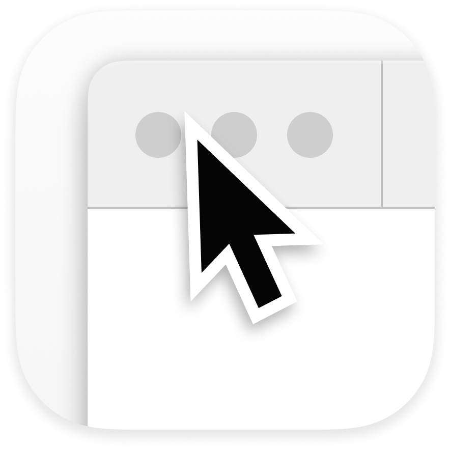

  
  <h1><b>CursorBounds</b></h1>
  
A Swift package for macOS that provides precise cursor positioning and contextual information about focused applications and windows.

  
  
  

---

## **What is CursorBounds?**

CursorBounds is a comprehensive Swift package that gives you precise information about:
- **Where the text cursor is** - Position, and bounds of the text caret, text field, or mouse cursor
- **What app is focused** - Identify the current application and window
- **Browser context** - Extract URLs, domains, and page titles from web browsers
- **Smart positioning** - Calculate optimal popup and overlay positions based on cursor position and size

## **Core Components**

### 🎯 **CursorBounds** - Precise Positioning
Get exact cursor coordinates with intelligent fallback:

|  |  |  |
|:---:|:---:|:---:|
| **Text Caret** | **Text Field Bounds** | **Mouse Cursor** |
| Precise blinking cursor position | Focused text area rectangle | Screen cursor as fallback |

### 🌐 **CursorContext** - App & Browser Intelligence
Understand what the user is doing:
- Detect focused applications and windows
- Extract website URLs and domains from browsers
- Identify search fields and page titles
- Configurable browser detection (18+ browsers supported)

## **Documentation**

**📖 [Complete Documentation](https://github.com/Aeastr/CursorBounds/wiki)** available in the CursorBounds Wiki

## **Requirements Notice**

| Requirement | Status | Description |
|-------------|--------|-------------|
| **Accessibility Permissions** | **🔴 Required** | Must be granted to use this package. The system will prompt users to grant these permissions. |
| **App Sandbox (Internal Use)** | **🟢 Optional** | Can remain enabled when tracking cursors within your own application. |
| **App Sandbox (External Use)** | **🚨 Must be disabled** | Required only if you need to track cursors in ***other*** applications (external apps). |

---

## Playground Demos

CursorBounds comes with a bundled demo app that lets you explore CursorBounds in action. Open the Xcode workspace, select the `CursorPlayground` target, and press **Run** to try it out.

### Current Origin Example

The **Current Origin** tab continuously displays the live caret position (or the best fallback) and lets you monitor changes in real-time.

### Capture Timer Example

The **Capture Timer** tab records cursor positions at a configurable interval, useful for sampling cursor movement over time.

### Smart Positioning Example (Popup)

CursorPlayground also features a pop example, while the app is running, pressing the configured keyboard shortcut will display a popup using the smart positioning method (see [Smart Positioning](https://github.com/Aeastr/CursorBounds/wiki/CursorBounds-API#smartpositionforpreferredpositionmargincorrectionmodecorner)). You can customize the keyboard shortcut in the Popup settings tab.

---

## License

This project is released under the MIT License. See [LICENSE](LICENSE.md) for details.

## Contributing

Contributions are welcome! Please feel free to submit a Pull Request! See [CONTRIBUTING.md](CONTRIBUTING.md) for guidelines.

## Support

If you like this project, please consider giving it a ⭐️

---

## Where to find me:  
- here, obviously.  
- [Twitter](https://x.com/AetherAurelia)  
- [Threads](https://www.threads.net/@aetheraurelia)  
- [Bluesky](https://bsky.app/profile/aethers.world)  
- [LinkedIn](https://www.linkedin.com/in/willjones24)

---

Built with 🍏🖱️🔲 by Aether

