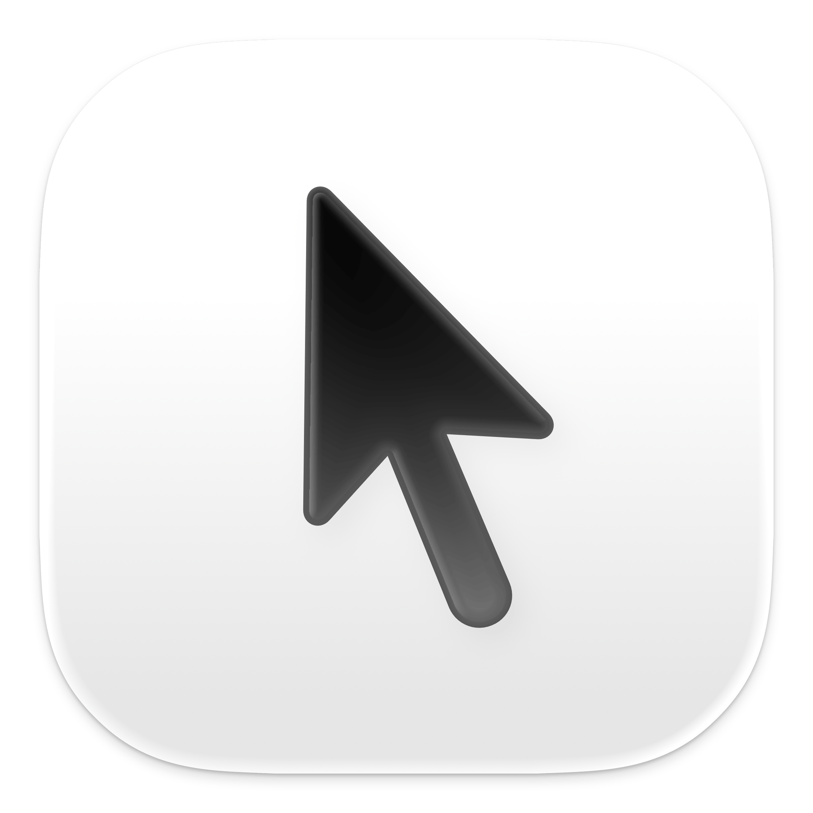

<div align="center">
  
  <h1><b>CursorBounds</b></h1>
  <p>A Swift package for macOS that provides precise cursor positioning and contextual information about focused applications and windows.</p>
</div>

<div align="center">
  <a href="https://swift.org">
    
  </a>
  <a href="https://www.apple.com/ios/">
    
  </a>
  <a href="LICENSE">
    
  </a>
</div>

---

## **What is CursorBounds?**

CursorBounds is a comprehensive Swift package that gives you precise information about:
- **Where the text cursor is** - Get exact pixel coordinates of the text caret
- **What app is focused** - Identify the current application and window
- **Browser context** - Extract URLs, domains, and page titles from web browsers
- **Smart positioning** - Calculate optimal popup and overlay positions

## **Core Components**

### 🎯 **CursorBounds** - Precise Positioning
Get exact cursor coordinates with intelligent fallback:

|  |  |  |
|:---:|:---:|:---:|
| **Text Caret** | **Text Field Bounds** | **Mouse Cursor** |
| Precise blinking cursor position | Focused text area rectangle | Screen cursor as fallback |

### 🌐 **CursorContext** - App & Browser Intelligence
Understand what the user is doing:
- Detect focused applications and windows
- Extract website URLs and domains from browsers
- Identify search fields and page titles
- Configurable browser detection (18+ browsers supported)

## **Key Features**

- **🎯 Precise Positioning** - Get exact text cursor coordinates
- **🔄 Smart Fallbacks** - Three-tier system ensures reliability
- **🌐 Browser Context** - Extract URLs, domains, and page info
- **⚡ Real-time Monitoring** - Track cursor movement with configurable polling
- **🛡️ Type-Safe API** - Swift-native with proper error handling
- **🔧 Highly Configurable** - Customize browser detection and behavior
- **📱 Modern Swift** - Uses latest Swift features and conventions

## **Documentation**

**📖 [Complete Documentation](https://github.com/Aeastr/CursorBounds/wiki)** available in the CursorBounds Wiki

## **Requirements**

- **macOS 12.0+** and **Swift 5.5+**
- **Accessibility Permissions** - Required for all functionality
- **App Sandbox** - Must be disabled for external app usage

## **Requirements Notice**

### **Accessibility Permissions**
**Required:** Accessibility permissions must be granted to use this package. The system will prompt users to grant these permissions.

### **App Sandbox**
**Internal:** App Sandbox can remain enabled when tracking cursors within your own application.

**External:** App Sandbox must be disabled **only** if you need to track cursors in *other* applications (external apps).

---

**📖 [Complete Documentation](https://github.com/Aeastr/CursorBounds/wiki)** available in the CursorBounds Wiki

### Current Origin Example


The **Current Origin** tab continuously displays the live caret position (or the best fallback) and lets you monitor changes in real-time.

### Capture Timer Example


The **Capture Timer** tab records cursor positions at a configurable interval, useful for sampling cursor movement over time.

Open the Xcode workspace, select the `CursorPlayground` target, and press **Run** to try it out.

---

## **Usage**

### **Basic Usage**

```swift
import CursorBounds

let cursorBounds = CursorBounds()

do {
    let position = try cursorBounds.cursorPosition()
    print("Cursor at: (\(position.x), \(position.y))")
    print("Detection method: \(position.type)")
} catch {
    print("Error: \(error.localizedDescription)")
}
```

### **Error Handling**

```swift
do {
    let position = try cursorBounds.cursorPosition()
    // Use the position...
} catch CursorBoundsError.accessibilityPermissionDenied {
    print("Need accessibility permissions")
    CursorBounds.requestAccessibilityPermissions()
} catch CursorBoundsError.noFocusedElement {
    print("No text field is focused")
} catch CursorBoundsError.cursorPositionUnavailable {
    print("Could not detect cursor position")
} catch CursorBoundsError.screenNotFound {
    print("Cursor is outside screen bounds")
}
```

### **Convenience Methods**

```swift
// Just get the point
let point = try cursorBounds.cursorPoint()
print("Cursor at: (\(point.x), \(point.y))")

// Just get the detection method
let type = try cursorBounds.cursorType()
print("Using: \(type)") // "Text Caret", "Text Field", or "Mouse Fallback"
```

### **Permission Management**

```swift
// Check permissions first
guard CursorBounds.isAccessibilityEnabled() else {
    print("Accessibility permissions required")
    CursorBounds.requestAccessibilityPermissions()
    return
}

// Now safe to get cursor position
let position = try cursorBounds.cursorPosition()
```

### **Coordinate System Options**

The Accessibility API returns coordinates in macOS's native coordinate system, where (0,0) is at the **bottom-left** corner of the screen. However, many UI frameworks (especially those designed for cross-platform compatibility) expect coordinates with (0,0) at the **top-left** corner, similar to iOS.

This difference exists because macOS historically used a bottom-left origin system, while iOS and many modern UI frameworks use a top-left origin. When displaying UI elements like popups or overlays, you typically want the flipped coordinates.

```swift
// Use raw macOS coordinates (bottom-left origin)
let position = try cursorBounds.cursorPosition(
    correctionMode: .none,
    corner: .bottomRight
)

// Use flipped coordinates (top-left origin, default)
let position = try cursorBounds.cursorPosition(
    correctionMode: .adjustForYAxis,  // default
    corner: .topLeft                  // default
)
```

#### **What You Get Back**

The `CursorPosition` struct contains:

```swift
public struct CursorPosition {
    public let point: NSPoint     // Final calculated position
    public let type: CursorType   // Detection method used
    public let bounds: CGRect     // Raw bounding rectangle
    
    public var x: CGFloat { point.x }  // Convenience property
    public var y: CGFloat { point.y }  // Convenience property
}
```

#### **Detection Methods**

The `type` property indicates how the cursor was detected:

```swift
public enum CursorType {
    case textCaret      // Precise text cursor position
    case textField      // Text field bounding area
    case mouseFallback  // Mouse cursor position (fallback)
}
```

---

## License

This project is released under the MIT License. See [LICENSE](LICENSE.md) for details.

## Contributing

Contributions are welcome! Please feel free to submit a Pull Request!

## Support

If you like this project, please consider giving it a ⭐️

---

## Where to find me:  
- here, obviously.  
- [Twitter](https://x.com/AetherAurelia)  
- [Threads](https://www.threads.net/@aetheraurelia)  
- [Bluesky](https://bsky.app/profile/aethers.world)  
- [LinkedIn](https://www.linkedin.com/in/willjones24)

---

<p align="center">Built with 🍏🖱️🔲 by Aether</p>
