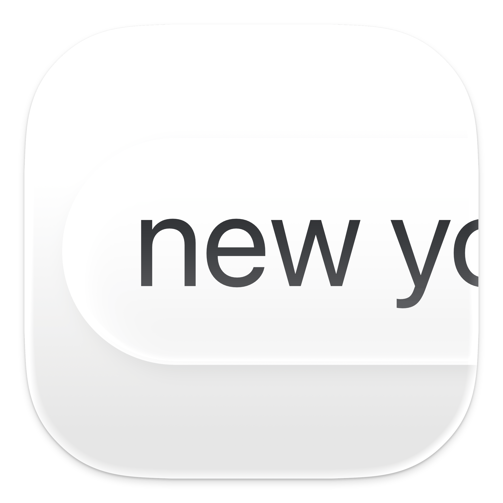

<div align="center">
  
  <h1><b>CursorBounds</b></h1>
  <p>Swift package that provides precise information about the position and bounds of the text cursor (caret) in macOS applications. It leverages the macOS Accessibility API to retrieve the caret's location and bounding rectangle, with fallbacks<br>
  <i>Compatible with macOS 12.0 and later</i></p>
</div>

---

## **Requirements**
- **macOS 12.0+**
- **Swift 5.5+**
- **Accessibility permissions must be granted to the app.**
- **App Sandbox must be disabled** (if you want to use this *outside* of your own app. 

**NOTICE:** This repository is currently outdated. A rework is underway to bring it up-to-date and introduce new features.

---

## **Positioning**

|  |  |  |
|:-----------------------------:|:-----------------------------:|:-----------------------------:|
| **Cursor Caret**                 | **Text Field/Area**               | **Cursor**             |
| Identifies the cursor caret, the blinking indicator that shows where text will be inserted. | Determines the bounding rectangle of the currently focused text area or input field. | Uses the screen position of the cursor if other methods are unavailable. |
| Works reliably in most text input scenarios. | Provides a general area when caret data is not accessible. | Acts as a backup to ensure the cursor's position is still available. |
| Preferred method for accuracy. | Handles cases where a text field is active but caret data cannot be retrieved. | Ensures functionality when no other data is accessible. |

CursorBounds primarily finds the cursor caret, _the blinking line or block that indicates where the next character will appear when typing_. 
If the caret's position cannot be retrieved, it falls back to the bounding rectangle of the focused text area or field. 
When neither the caret nor the bounding rectangle is accessible, it uses the position of the mouse cursor as a final fallback.

---

## **Features**
- Retrieve the position of the text caret (cursor) in macOS apps.
- Get the bounding rectangle of the caret for text fields and text areas.
- Graceful handling of unsupported or restricted applications.
- Built-in fallback mechanisms for robust behavior.
- Error logging and levels (see below, or check documentation)

---

## **Installation**

### **Swift Package Manager**
To include `CursorBounds` in your project:

1. Open your Xcode project.
2. Go to **File > Add Packages...**.
3. Paste the following URL in the search bar:
   ```
   https://github.com/aeastr/CursorBounds.git
   ```
4. Choose the desired version and click **Add Package**.

---

## **Main Usage**

### **Getting the Origin**

To retrieve the current origin, call the `getOrigin` method:

```swift
let origin = CursorBounds().getOrigin()
```

The getOrigin method accepts the following parameters:
1. correctionMode (default: .adjustForYAxis):
- Determines whether to apply a Y-axis correction to account for screen coordinate differences between CGPoint and NSPoint.
- Options:
  - .none: No correction is applied.
  - .adjustForYAxis: Adjusts the Y-coordinate to align with the screen’s coordinate system.
  
2. xCorner (default: .minX):
- Specifies which X-coordinate of the bounding box to use.
- Options:
  - .minX: Use the minimum X-coordinate.
  - .maxX: Use the maximum X-coordinate.
  
3. yCorner (default: .minY):
- Specifies which Y-coordinate of the bounding box to use.
- Options:
  - .minY: Use the minimum Y-coordinate.
  - .maxY: Use the maximum Y-coordinate.

### **Default Behavior**

```swift
if let origin = CursorBounds().getOrigin() {
    print("Origin ID: \(origin.id)")
    print("Origin Type: \(origin.type.rawValue)")
    print("Origin Coordinates: x = \(origin.NSPoint.x), y = \(origin.NSPoint.y)")
} else {
    print("Failed to retrieve origin.")
}
```

### **Customized Behavior**

```swift
if let origin = CursorBounds().getOrigin(correctionMode: .none) {
print("Origin Coordinates without Y-axis correction: x = \(origin.NSPoint.x), y = \(origin.NSPoint.y)")
}
```

```swift
if let origin = CursorBounds().getOrigin(xCorner: .maxX, yCorner: .maxY) {
print("Top-right corner coordinates: x = \(origin.NSPoint.x), y = \(origin.NSPoint.y)")
}
```

```swift
if let origin = CursorBounds().getOrigin(correctionMode: .none, xCorner: .maxX, yCorner: .minY) {
print("Ucorrected bottom-right corner coordinates: x = \(origin.NSPoint.x), y = \(origin.NSPoint.y)")
}
```

#### **What `getOrigin` Returns**

The `getOrigin` method returns an optional `Origin` object (`Origin?`). If successful, you’ll receive an `Origin` with the following structure:

```swift
public struct Origin: Hashable {
    public private(set) var id: UUID
    public var type: OriginType
    public var NSPoint: NSPoint

    public init(id: UUID = UUID(), type: OriginType, NSPoint: NSPoint) {
        self.id = id
        self.type = type
        self.NSPoint = NSPoint
    }
}
```

NSPoint in `Origin` represents the calculated location of the top left point of the rect

#### **Understanding `OriginType`**

The `type` property of `Origin` indicates the source of the origin. It is an enum with the following cases:

```swift
public enum OriginType: String {
    case caret = "Caret"             // Represents a caret position
    case rect = "Text Rect"          // Represents a text field/area bounding rect
    case mouseCursor = "Mouse Cursor" // Represents the mouse cursor position
}
```

### **Setting the Debug Level**

You can control the verbosity of the logs by setting the `logLevel` in `CursorBoundsConfig`. [View log documentation](docs/logs.md) For example, to enable debug-level logging:

```swift
CursorBoundsConfig.shared.logLevel = .debug
```

The available log levels include:
- `.debug`: For detailed information useful during development.
- `.info`: For general informational logs.
- `.warning`: For recoverable issues.
- `.error`: For critical errors.
- `.none`: No logs at all.

---

## Playground

[CursorPlayground](CursorPlayground) is included in this package, you can quickly test out the main function of CursorBounds here

---

## **Permissions**

To use this package, your app must have **Accessibility permissions**, and **App Sandbox must be disabled**. **Accessibility permissions** can be configured in **System Preferences > Privacy & Security > Accessibility**. Ensure that your app is checked in the list of allowed apps.

---

## License

This project is released under the MIT License. See [LICENSE](LICENSE.md) for details.


## Contributing

Contributions are welcome! Please feel free to submit a Pull Request!

## Support

If you like this project, please consider giving it a ⭐️

---

## Where to find me:  
- here, obviously.  
- [Twitter](https://x.com/AetherAurelia)  
- [Threads](https://www.threads.net/@aetheraurelia)  
- [Bluesky](https://bsky.app/profile/aethers.world)  
- [LinkedIn](https://www.linkedin.com/in/willjones24)

---

<p align="center">Built with 🍏🖱️🔲 by Aether</p>
